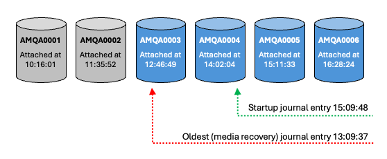

# Automating Management of IBM MQ Journal Receivers on IBM i

#### Mark Phillips - IBM MQ Development - IBM Hursley 
#### Mike Alexander - IBM MQ Development - IBM Rochester 
#### Martin Smith - IBM MQ Service - IBM Rochester

## Abstract

This repository provides a sample program which demonstrates how to automate the deletion of journal receivers used by an IBM MQ queue manager on IBM i.

## Introduction

During the normal operation of an IBM MQ queue manager, a record is kept of transactions, persistent messages and changes to queue manager object attributes. This record (or log) of changes is written into the AMQAJRN journal in the queue manager's library. To ensure data integrity, the journal entries are forced to disk, so the journal log represents the definitive history of processing for the queue manager.

Because of its high integrity, the log plays a vital role in the recovery of queue manager data in the event of an abnormal termination, and enables IBM MQ to recover queue manager objects if they become damaged. There is a price for this data integrity however, in that keeping all this recovery data consumes a large amount of disk space.

The AMQAJRN journal has a single attached journal receiver, to which journalled data is appended until the receiver reaches a predefined threshold size. When the receiver threshold size is reached, the operating system detaches the attached receiver, and attaches a new one.

As time goes on, the information contained in older journal receivers is superseded, making the receivers redundant and eligible for deletion. IBM MQ does not automatically archive and delete these redundant journal receivers, so journal housekeeping must be either be performed manually by the system administrator, or automatically by a process such as the one described here.

## Manual Journal Housekeeping

IBM MQ writes information about journal receivers that are still needed into a user space object named `AMQJRNINF` in the queue manager library. This user space contains the name and timestamp of the oldest IBM MQ journal receiver information that is required for safe operations and assured startup. 

An MQ administrator can manually check the user space with the IBM i `DSPF` command.  For example, for a queue manager named TEST using library QMTEST, use the command: 
```
DSPF '/QSYS.LIB/QMTEST.LIB/AMQJRNINF.USRSPC'
```
If the QMTEST library is in an iASP, include the iASP name before /QSYS.LIB.

The administrator can then delete receivers older than the one named in the user space (i.e. those with a lower number). However they must be careful to never delete the receiver named in the user space, nor to delete any journal receiver newer (higher numbered) than that. Ths could cause the queue manager to crash or to fail to start (necessitating assistance from IBM Support to perform a coldstart) and could lead to data loss. 

For more information about manual journal management see: 
<br>https://www.ibm.com/docs/en/ibm-mq/9.4?topic=data-journal-management-i

## Automated Journal Housekeeping

This repository provides a utility program and command which check the queue manager's user space object automatically, and (optionally) delete journal receivers that are no longer required by the queue manager.

The command invokes a C program which takes the following steps:

1. Reads the AMQJRNINF user space object to get timestamp of the oldest journal entry that IBM MQ needs for restart or for media recovery.

2. Uses an IBM i journal API call (QjoRetrieveJournalInformation) to get the list of receivers that are associated with the queue manager's AMQAJRN journal. Note that the program has been written to handle an arbitrary limit of up to 256 receivers in the receiver chain. While this limit could be changed, it is not recommended that you allow receiver chains to get near this size.

3. Loops through the list of journal receivers from the newest to the oldest, to determine the receiver that contains the oldest journal entry. This will be the oldest receiver that is needed by the queue manager. To find this receiver, the program compares the timestamp of the oldest journal entry to the time that each receiver was attached to the journal. The first journal receiver the program finds that was attached before the oldest entry was written will contain the oldest journal entry.

4. (Optionally) loops through the list of receivers from the oldest to the newest deleting any journal receivers that are older than the one that contains the oldest journal entry.

For example, in Figure 1, the oldest journal entry we need to keep is the "Media Recovery" entry time stamped 13:09:07. (Note that the timestamps used by the program are in the form CYYMMDDHHMMSSmmm, but we will use HH:MM:SS in this example for the sake of simplicity)


<br>_Figure 1_

We start our search at the current receiver AMQA0006 which was attached at 16:28:24.  Receivers AMQA0006, AMQA0005, and AMQA0004 are after our timestamp, so we need to keep them. Receiver AMQA0003 was attached at 12:46:49 - before the entry we're looking for - so this is the receiver that contains the oldest journal entry and we need to keep it.  Earlier receivers do not contain any useful information, and can be safely deleted.

## Downloading and compiling the journal maintenance command and program

The sample is provided as a native IBM i command and a C program in two source files. 
Download the source by saving the following links.

* [jrnmaint.c](src/jrnmaint.c)
* [mqjrnmaint.cmd](src/mqjrnmnt.cmd)

Log on to your IBM i system, and type the following commands to create a library and source files:

```
CRTLIB MQJRNMNT
CRTSRCPF MQJRNMNT/QCSRC
CRTSRCPF MQJRNMNT/QCMDSRC
```

Transfer the source to your IBM i system. For example to use FTP, type the following commands:

```
FTP (IBM i hostname)
-- log on --
ASCII
CD MQJRNMNT
PUT jrnmaint.c QCSRC.JRNMAINT
PUT mqjrnmaint.cmd QCMDSRC.MQJRNMNT
QUIT
```

Type the following on the IBM i system to compile the C program and the CL command:

```
CRTBNDC MQJRNMNT/JRNMAINT MQJRNMNT/QCSRC
CRTCMD  CMD(MQJRNMNT/MQJRNMNT)
        PGM(MQJRNMNT/JRNMAINT)
        SRCFILE(MQJRNMNT/QCMDSRC)
```

## Invoking the journal maintenance command
The journal maintenance command (MQJRNMNT) has three parameters. To prompt the command type MQJRNMNT and press F4. Figure 2 shows the options available.


<br>_Figure 2_

The parameters are :

| Parameter | Option |
| --- | --- |
| QMGRLIB | Supply the name of the queue manager library. You can determine the name of the queue manager library by looking in the /QIBM/UserData/mqm/mqs.ini file |
| OUTPUT | *PRINT - Display output to STDOUT (This is the default)<br>*MSGQ - Send output to queue manager message queue (QMQMMSG in queue manager library) |
| DLTRCV | *NO - Will execute the program in report mode - no receivers will be deleted (This is the default)<br>*YES - ... Will execute the program in report mode - no receivers will be deleted |

Figure 3 shows a sample of the output when the program is run with OUTPUT(*PRINT) and DLTRCV(*YES). The output shows that eleven receivers are associated with AMQAJRN. The timestamp of the oldest entry is 14:05:35 on 27/05/03. This entry is contained within receiver AMQA000008, so receiver AMQA000007 and earlier receivers can be deleted.


<br>_Figure 3_


When using MQJRNMNT as part of an automated journal management strategy you should consider periodically recording media images of all your queue manager objects. 
For example, the following commands...

```
CHGJRN JRN(QMGRLIB/AMQAJRN) JRNRCV(*GEN)
RCDMQMIMG OBJ(*ALL) OBJTYPE(*ALL) MQMNAME(YourQMGR) DSPJRNDTA(*YES)
MQJRNMNT QMGRLIB(QMGRLIB) DLTRCV(*YES)
```

...will generate and attach a new empty journal receiver, record the current media image and checkpoint, then delete any unneeded journal receivers. It would be a good idea to save the journal receivers before deleting them. Consider saving the manager's library or adding logic to the sample C code to save the receivers before the delete.

In an ideal situation the oldest receiver required by IBM MQ will be the receiver which is currently attached, but typically a few older journal receivers will be required. However, if the oldest required receiver is a significant number of receivers distant from the currently attached receiver then the queue manager may have long-running transactions, or in-doubt channels.  Resolving these situations will reduce the number of receivers needed on the system.

Note that the journal receivers created by IBM MQ are owned by the QMQM profile, so the utility MQJRNMNT and all the above commands should run under user profile QMQM or have *ALLOBJ authority for the DLTRCV option to work.


## Summary
Run the MQJRNMNT command in report-only mode a few times to verify that the command will delete the same set of journal receivers that you would delete after a manual check of the user space AMQJRNINF in the manager library.

Once you are satisfied that the command will meet your needs, it can be incorporated into your journal housekeeping routine replacing manual housekeeping. MQJRNMNT does not lock the journal and only uses a small amount of CPU, so can be run without any need to quiesce the queue manager.

You can run MQJRNMNT at regular intervals as a scheduled job, or reuse the logic in jrnmaint.c in a Delete Journal Receiver exit program to indicate whether a receiver is eligible for deletion.


_**IBM, IBM i, IBM MQ and IBM MQ for IBM i are trademarks of IBM Corporation in the United States, other countries, or both**_
